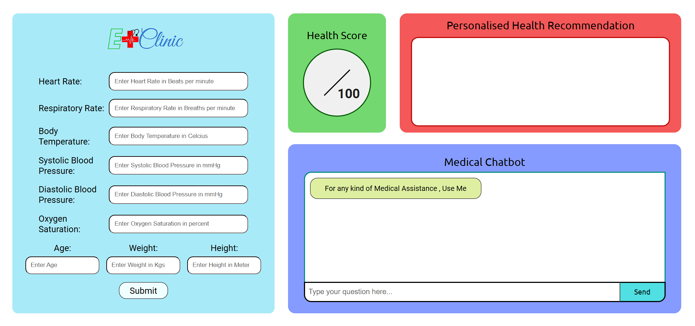
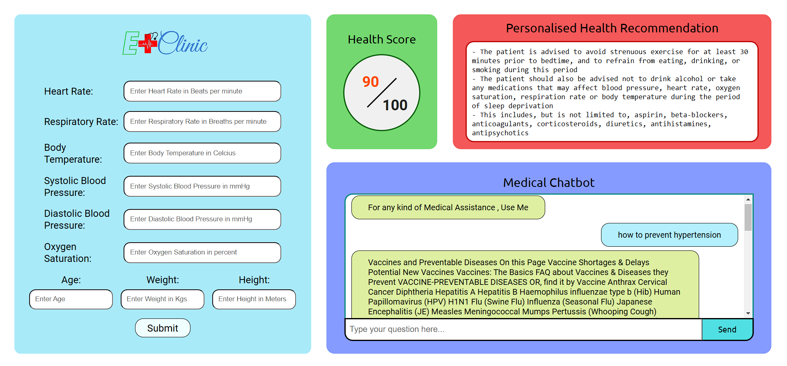

# E-Clinic with Chatbot: AI-Powered Health Monitoring and Recommendations

***E-Clinic with Chatbot*** is a comprehensive platform that leverages **AI** to predict health scores, provide personalized health recommendations, and answer medical queries. It aims to make health monitoring accessible, accurate, and user-friendly.

---
## 📸 **Model Results: Before and After**

### **Before Using the Model:**



### **After Using the Model:**



## 🚀 Features

- **Health Scoring**: Predicts health scores based on vital signs and other data.
- **Personalized Plans**: Provides tailored sleep, step, and diet plans based on the health score using **GPT-2 Medium**.
- **Medical Q&A Chatbot**: Answers medical queries using **medquad.csv** and **BLOOMZ-560M** models.
- **Secure Data Handling**: Ensures data privacy with blockchain-backed solutions.

---

## 🛠 Technologies Used

- **Programming Language**: Python
- **Framework**: Flask (Backend)
- **Frontend**: HTML, CSS, JavaScript
- **Machine Learning Models**:
  - Random Forest
  - Gradient Boosting
  - Neural Networks
- **AI Models**:
  - GPT-2 Medium
  - BLOOMZ-560M
- **Data**:
  - `medquad.csv`: Medical Q&A data for the chatbot.
  - `Final_E-clinic_dataset.csv`: Patient data for health score prediction after Data Preprocessing.
  - `life_suitability_data.csv`: Patient data before Data Preprocessing.
---

## ⚡ Installation

Follow these steps to set up the project:

### 1. Clone the Repository

Clone the repository to your local machine:
```bash
git clone https://github.com/buggytanmoy77/e-clinic.git
```

### 2. Navigate to the Project Directory
Change the directory to the project folder:

```bash
cd E-Clinic
```
### 3. Install the Required Dependencies
Install all the necessary Python packages:

```bash
pip install -r requirements.txt
```
## 🚀 Usage Instructions
### 1. Generate the Model File
Before running the application, you need to generate the .pkl file for the health score model:

```bash
python score_model.py
```
### 2. Run the Application
Start the Flask application by running:
```bash
python app.py
```
### 3. Access the Application
Open your browser and go to:
```bash
http://127.0.0.1:5000
```
## 📂 Folder Structure
- `app.py`: Main application script that runs the Flask web server.
- `score_model.py`: Script to generate the model .pkl file for health score predictions.
- `static/`: Contains static assets (CSS, JavaScript, images).
- `templates/`: HTML templates for the web interface.
- `requirements.txt`: Lists all Python dependencies.
- `medquad.csv`: Medical Q&A data for the chatbot.
- `Final_E-Clinic_dataset.csv`: Patient data for health score prediction.

## 📊 Dataset
This project uses the following CSV files:

 - `medquad.csv`:  Contains medical Q&A data for chatbot interactions.
 - `Final_E-clinic_dataset.csv`:  Contains patient data for predicting health scores based on vital signs after Data Preprocessing.
 - `life_suitability_data.csv`: Patient data before Data Preprocessing (optional).

Ensure these files are placed within the project directory.

## 📞 Contact
For any questions or feedback, reach out to:

[**Email**](mailto:ad2004ankita@gmail.com)
[**LinkedIn**](https://www.linkedin.com/in/ankita-devi-24421726a/) (ankitadevi)

[**Email**](mailto:talukdartanmay116@gmail.com)
[**LinkedIn**](https://www.linkedin.com/in/tanmoy-talukdar-330a78281/) (buggytanmoy77)

## 🎯 Future Enhancements
- ***Wearable Integration***: Link with smartwatches and fitness trackers to enhance data collection.
- ***Global Expansion***: Localized health insights and multi-language support.
- ***Mental Health Services***: Add counseling and mental health features to the platform.


